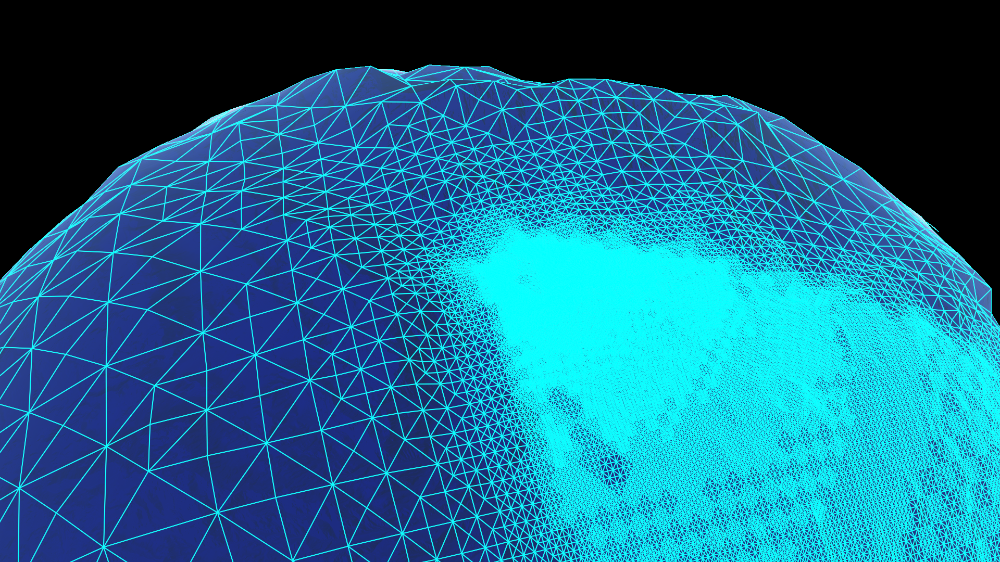
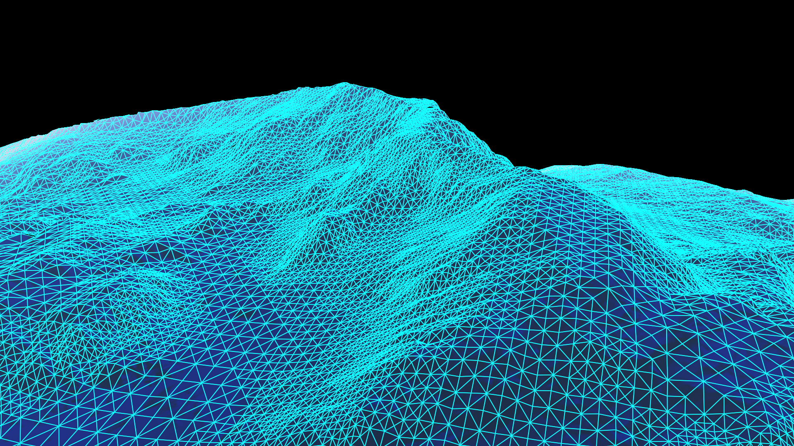
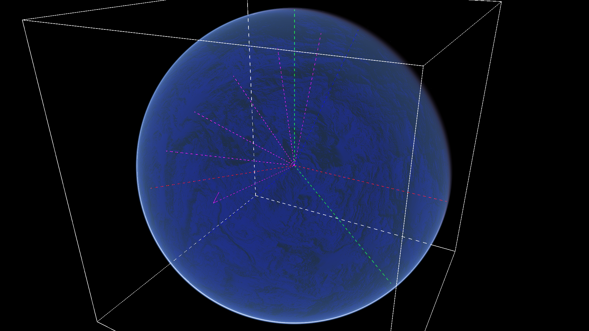

[](https://webchat.freenode.net/?channels=ada)
[](https://gitter.im/ada-lang/Lobby)

# Orka demo

This is a demo for the [Orka][url-orka] rendering kernel written in Ada 2012.
It uses precomputed atmospheric scattering, adaptively tesselated terrain, it
can blur the screen using a gaussian blur or a moving average filter in a compute
shader. An RK4 numerical integrator is used to simulate a "satellite" making orbits
at 200 km altitude.

This demo has only been tested on Linux with an Intel GPU with Mesa's i965 and Iris drivers.
If you have a different OS or GPU, let me know if it works :slightly_smiling_face:

In the future GLFW will be replaced with [AWT][url-awt] for keyboard support
and [evdev-ada][url-evdev-ada] for force-feedback support. AWT only supports Wayland at
the moment, but hopefully someone can help with writing a win32 backend.

## Github stars

If you would like to star this project, consider starring [Orka][url-orka] instead
(or both :slightly_smiling_face:).

## Screenshots

Triangle culling of terrain based on frustum and distance from camera:



Increased the minimum level of detail (LoD) variance for less triangles for flat terrain:



Bounding box, coordinate axes (1 aligned with the bounding box (GL coordinates)
and 1 aligned with north pole and (0, 0) lat/lon (ECEF)), and some lines on the
prime meridian (0 longitude) and satellite:



## Dependencies

 * Ada 2012 compiler

 * [Alire][url-alire]

 * [GLFW][url-glfw] 3.3

 * `make` (optional, useful on Linux)

## Getting started

Download [Orka][url-orka] and this repository:

```sh
git clone https://github.com/onox/orka
git clone https://github.com/onox/orka-demo
cd orka-demo
```

On Linux, to build and run the app:

```sh
make
```

On Windows:

```sh
mkdir results
alr build -XORKA_SIMD_EXT="AVX2"
alr run -s
```

The first time the app runs, it needs a few seconds to precompute some
textures (which will be stored in the `results` folder).

## Usage

Hold right mouse button to rotate the camera.

If you have a gamepad, you can use the following buttons and axes:

| Button/axis                            | Function                               |
|----------------------------------------|----------------------------------------|
| Cross/A                                | View sphere/planet/satellite           |
| Circle/B                               | Toggle blur post-processing            |
| Square/X                               | Freeze updating wireframe              |
| Triangle/Y                             | Toggle terrain wireframe               |
| Left stick                             | Rotate planet                          |
| DPad up/down                           | Increase/decrease meshlet subdivision  |
| DPad left/right                        | Increase/decrease min LOD stddev       |
| DPad up/down (+ hold Options/Start)    | Change distance to Sun                 |
| DPad left/right (+ hold Options/Start) | Change blurriness                      |
| Share/Back                             | Use texture or compute slope in shader |
| L1/R1                                  | Increase/decrease exposure             |

To see displaced terrain (mountains), set `Displace_Terrain` to True in `src/orka_demo.adb`
and multiply `z` by a 1000.0 in function `planeToSphere` in
`../orka/orka_plugin_terrain/data/shaders/terrain/terrain-render-sphere.glsl`.

## Problems

Some things are still problematic:

1. The precomputed atmosphere assumes the planet has no flattening
   (for space/time complexity reasons), but in reality the semi-minor axis of
   the Earth (center to northpole) is 0.3 % of the semi-major axis (center to equator).
   This gives a difference of about 20 km. The tesselated terrain can
   handle flattening though, so a hack is applied when the camera is near the surface
   to partially fix the atmosphere near the horizon. But I don't think it works
   that great and it needs further improvements.
   Perhaps it's better to pretend the Earth is not flattened at all...

2. The original terrain code worked only on a single flat tile (without any problems).
   To render a planet, 6 tiles are needed (only 2 to 5 can be visible).
   These tiles are also curved and then
   warped to reduce the RMSE when projecting cubes on spheres.
   When you zoom out and view the planet at a distance, some parts of each
   tile like the center or corners get less or more subdivisions than you would
   expect based on the distance from the camera to the surface.
   This problems shows up more clearly when you change `Meshlet_Subdivision`
   to 1 in `src/orka_demo.adb`.

3. Frustum/occlusion culling
   (in `orka/orka_plugin_terrain/data/shaders/terrain/terrain-update-lod.comp`)
   might need to be fixed when terrain is displaced. All tiles currently use
   2 textures in `data/terrain/texture-4k-dmap.ktx` (height map) and
   `data/terrain/texture-4k-smap.ktx` (slope map). To get the actual terrain
   of the Earth rendered, NASA SRTM DEM data is needed and converted to a
   `UShort_Array` (for the height map) and `Single_Array` for the slope map and
   then write it to a .ktx texture.
   See `orka/orka_plugin_terrain/data/shaders/terrain/terrain-render-sphere.glsl`
   for how a point on a plane/tile is changed to a point on a sphere.

   dmap is RG16 (2x UNSIGNED_SHORT) (86 MiB) or COMPRESSED_RG_RGTC2 (17 MiB)
   smap is RG32F (2x FLOAT) (171 MiB) or Compressed_RGB_BPTC_Signed_Float (22 MiB)

4. Intel GPUs cannot handle very large max terrain subdivision levels, which limits
   the maximum terrain resolution. Currently
   the maximum `Terrain_Max_Depth` is set to 20. Discrete GPUs might handle
   larger values. A value of 20 gives a resolution of about 2 km per triangle.
   A way needs to be found to also render terrain with a higher resolution
   when the camera is close to the surface. Either replace the (up to) 5 tiles
   with 1 to 3 smaller tiles (3 when viewing a corner of the Earth cube)
   or have 1 extra very small tile that is always somewhat
   in the center of the screen (between the camera and the center of the Earth).

5. If you increase `Earth_Rotation_Speedup` the camera starts to rotate around
   the viewed object. Also the positions of some objects/geometry are not fixed
   relative to each other in 1 frame. Not sure why that is happening. Use a
   large value like 1000 to see the problem.

6. The camera code of Orka is quite OOP-ish and sucks. Needs to be rewritten.
   Orka currently uses game objects instead of ECS. Package `Orka.Loops` also
   sucks. And there's no frame graph yet...

## License

KTX textures `data/terrain/texture-4k-dmap.ktx` and `data/terrain/texture-4k-smap.ktx`
are based on the file [Terrain4k.png][url-terrain-png],
which is public domain displacement map by Cyril Jover (https://twitter.com/jovercyril).

`data/gamecontrollerdb.txt` from [SDL_GameControllerDB][url-gamecontrollerdb]
and licensed under the Zlib license.

  [url-alire]: https://alire.ada.dev/
  [url-awt]: https://github.com/onox/awt
  [url-evdev-ada]: https://github.com/onox/evdev-ada
  [url-gamecontrollerdb]: https://github.com/gabomdq/SDL_GameControllerDB
  [url-glfw]: http://www.glfw.org/
  [url-orka]: https://github.com/onox/orka
  [url-terrain-png]: https://github.com/jdupuy/LongestEdgeBisectionDemos/blob/master/assets/Terrain4k.png
